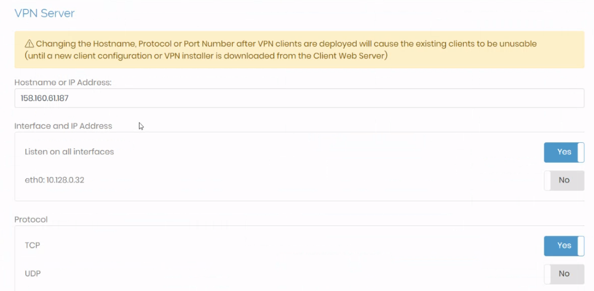

University: [ITMO University](https://itmo.ru/ru/) \
Faculty: [FICT](https://fict.itmo.ru) \
Course: [Network programming](https://github.com/itmo-ict-faculty/network-programming) \
Year: 2023/2024 \
Group: K34202 \
Author: Shabashov Vasiliy Andreevich \
Lab: Lab1 \
Date of create: 16.11.2023

# Лабораторная работа №1 "Установка CHR и Ansible, настройка VPN"

## Цель работы
Целью данной работы является развертывание виртуальной машины с установленной системой контроля конфигураций Ansible и установка CHR в VirtualBox.

## Ход работы
Мы установили виртуальную машину с операционной системой Ubuntu 20.04 на платформе Яндекс.Облако, после чего произвели установку python3 и Ansible.

Мы решили создать свой собственный сервер OpenVPN. Сначала мы убедились, что все пакеты и зависимости нашей операционной системы Ubuntu 20.04 актуальны, и обновили их при необходимости. Затем мы добавили сервер OpenVPN в список репозиториев и произвели установку сервера доступа OpenVPN:
```
apt install openvpn-as
```


Была произведена установка CHR (RouterOS) на VirtualBox. При первом входе от имени пользователя admin необходимо было задать пароль, так как по умолчанию он отсутствовал. \


Мы установили конфигурацию OpenVPN сервера и загрузили файл с настройками, который был предварительно скачан на сервере. \



Теперь мы создали OpenVPN интерфейс, чтобы установить VPN туннель для обеспечения защищенной связи с сервером. \


Проверка соединения: \


Таким образом, был установлен VPN туннель между VPN сервером на операционной системе Ubuntu 20.04 и VPN клиентом на RouterOS (CHR).

## Вывод
В процессе выполнения задач мы освоили навыки настройки виртуальных машин и систем управления конфигурациями с использованием Ansible. Также мы успешно развернули свой собственный VPN сервер, который обеспечивает защищенное соединение с удаленными клиентами. Этот опыт позволил нам на практике изучить принципы работы VPN туннелей и настроить их между сервером на операционной системе Ubuntu 20.04 и клиентом на RouterOS (CHR).
