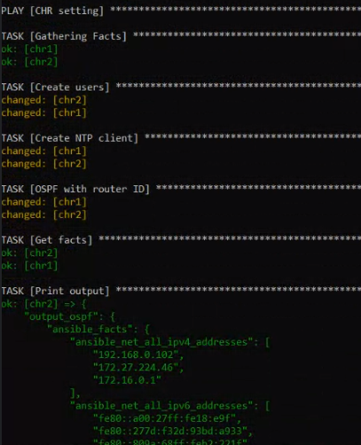
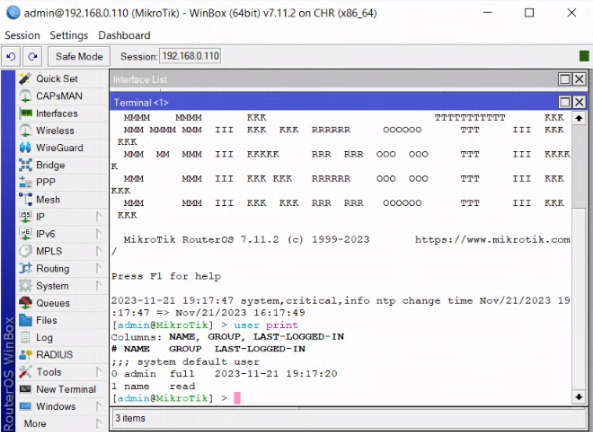
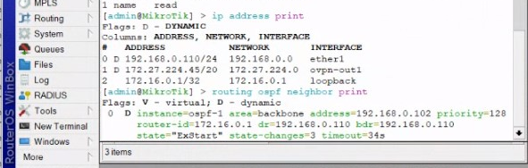
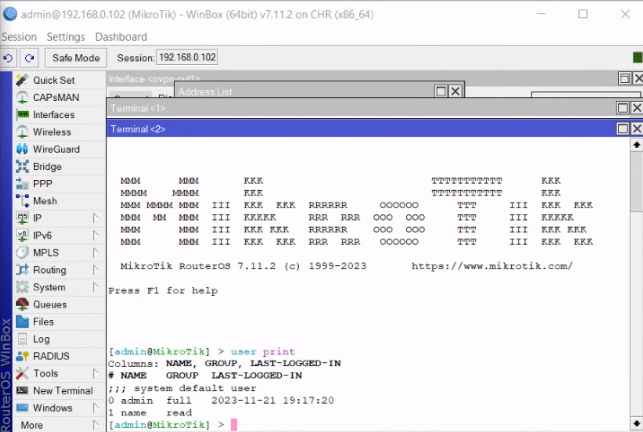
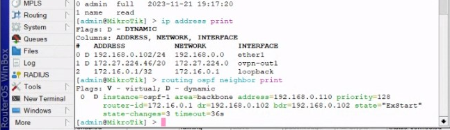
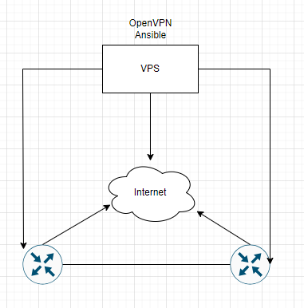

University: [ITMO University](https://itmo.ru/ru/) \
Faculty: [FICT](https://fict.itmo.ru) \
Course: [Network programming](https://github.com/itmo-ict-faculty/network-programming) \
Year: 2023/2024 \
Group: K34202 \
Author: Shabashov Vasiliy Andreevich \
Lab: Lab2 \
Date of create: 27.11.2023

# Лабораторная работа №2 "Развертывание дополнительного CHR, первый сценарий Ansible"

## Цель работы
С помощью Ansible настроить несколько сетевых устройств и собрать информацию о них. Правильно собрать файл Inventory.

## Ход работы

Мы произвели установку второго CHR на компьютере и создали второй клиент OVPN на этом CHR, аналогично установке первого CHR. \
Далее установили библиотеку Ansible, чтобы работать по протоколу SSH.

Создали файл hosts.ini, в котором прописали конфигурационные настройки для обоих CHR. В этом файле мы указали адреса и учетные данные для подключения к каждому CHR, чтобы иметь возможность управлять ими при помощи Ansible. \
Проверили подключение командой ```ansible -i hosts.ini -m ping chr```
```
[chr]
chr1 ansible_host=172.27.224.3
chr2 ansible_host=172.27.224.46

[chr:vars]
ansible_connection=ansible.netcommon.network_cli
ansible_network_os=community.routeros.routeros
ansible_user=admin
ansible_ssh_pass=admin
```


Далее был создан и выполнен файл ansible_playbook.yml с настройками конфигурации.
```
---
- name:  CHR setting
  hosts: chr
  tasks:
    - name: Create users
      routeros_command:
        commands: 
          - /user add name=name group=read password=name

    - name: Create NTP client
      routeros_command:
        commands:
          - /system ntp client set enabled=yes server=0.ru.pool.ntp.org
        
    - name: OSPF with router ID
      routeros_command:
        commands: 
          - /interface bridge add name=loopback
          - /ip address add address=172.16.0.1 interface=loopback network=172.16.0.1
          - /routing id add disabled=no id=172.16.0.1 name=OSPF_ID select-dynamic-id=""
          - /routing ospf instance add name=ospf-1 originate-default=always router-id=OSPF_ID
          - /routing ospf area add instance=ospf-1 name=backbone
          - /routing ospf interface-template add area=backbone auth=md5 auth-key=admin interface=ether1

    - name: Get facts
      routeros_facts:
        gather_subset:
          - interfaces
      register: output_ospf

    - name: Print output
      debug:
        var: "output_ospf"
```


Проверяем связь NTP Client.

 \
 \
 \


## Вывод
С использованием Ansible мы успешно произвели настройку нескольких сетевых устройств и получили информацию о них. Создали файл Inventory, в котором хранятся данные о конфигурации каждого устройства. В этом файле мы указали адреса, учетные данные и другие параметры, необходимые для работы с каждым устройством при помощи Ansible.

[Конфигурация устройства CHR 1](routerOS1.txt) \
[Конфигурация устройства CHR 2](routerOS2.txt)

