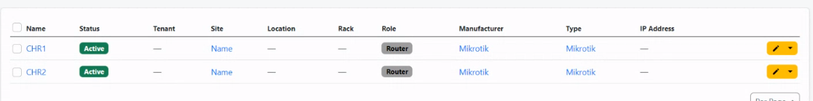

University: [ITMO University](https://itmo.ru/ru/) \
Faculty: [FICT](https://fict.itmo.ru) \
Course: [Network programming](https://github.com/itmo-ict-faculty/network-programming) \
Year: 2023/2024 \
Group: K34202 \
Author: Shabashov Vasiliy Andreevich \
Lab: Lab3 \
Date of create: 01.12.2023


# Лабораторная работа №3 "Развертывание Netbox, сеть связи как источник правды в системе технического учета Netbox"

## Цель работы
С помощью Ansible и Netbox собрать всю возможную информацию об устройствах и сохранить их в отдельном файле.

## Ход работы
Для продолжения работы с Netbox мы выполнили установку PostgreSQL. После установки мы создали базу данных netbox и создали в ней пользователя с именем netbox.
```
apt install postgresql
```
```
sudo -u postgres psql
```
```
CREATE DATABASE netbox;
```
```
CREATE USER netbox WITH password 'netbox';
```
```
GRANT ALL PRIVILEGES ON DATABASE netbox to netbox;
```
После этого установили redis командой ```apt install redis-server``` и из [репозитория](https://github.com/netbox-community/netbox/archive/v3.3.9.tar.gz) установили netbox.
```
sudo wget https://github.com/netbox-community/netbox/archive/refs/tags/v3.3.9.tar.gz
```
```
sudo tar -xzf v3.3.9.tar.gz -C /opt
```
```
sudo ln -s /opt/netbox-3.3.9/ /opt/netbox
```
Потом мы создали пользователя
```
groupadd --system netbox
```
```
sudo adduser --system -g netbox netbox
```
```
chown --recursive netbox /opt/netbox/netbox/media/
```
Создали виртуальное окружение, установили зависимости. \
Скопировали и отредактировали файл конфигурации, добавив секретный ключ, сгенерированный командой ```python3 ../generate_secret_key.py```

 \


После этого мы запустили миграции, чтобы обновить схему базы данных и применить все необходимые изменения. Потом создали суперпользователя и загрузили статические файлы. \
Затем были установлены и настроены nginx и gunicor. \
Отредактировали файл nginx.conf, был добавлен новый хост и удалены настройки для https сервера.


После того как мы вошли в систему netbox под учетной записью суперпользователя, которая была предварительно создана, мы добавили информацию о CHR и скачали [файл](netbox_devices.csv).



Создан файл playbook_chr.yml, в нем название роутера для изменения переносится в файл new_playbook.yml. Информация о роутере берется из файла netbox_devices.csv.


Успешно выполнили playbook_chr.yml


Названия CHR1 и CHR2 были изменены с учетом информации из файла new_playbook.yml.


Был сгенерирован токен в Netbox, после чего создан файл playbook_netbox.yml. В данном файле указаны необходимые настройки для внесения изменений в Netbox, включая использование предварительно сгенерированного токена.


Успешно выполнили playbook_netbox.yml


Зашли в Netbox и увидели новый добавленный девайс


## Вывод
С использованием Ansible и Netbox была собрана информация об устройствах, а затем сохранена в отдельном файле. Далее были написаны плейбуки, обеспечивающие связь между Netbox и устройствами CHR. Эти плейбуки выполняют необходимые действия для установки соответствия и обновления данных между Netbox и устройствами CHR.

Пинги

 \


Схема


Name,Status,Tenant,Site,Location,Rack,Role,Manufacturer,Type,IP Address,ID,Tenant Group,Platform,Serial number,Asset tag,Region,Site Group,Position (U),Rack face,Airflow,IPv4 Address,IPv6 Address,Cluster,Virtual chassis,VC Position,VC Priority,Comments,Contacts,Tags,Created,Last updated
CHR1,Active,,Name,,,Router,Mikrotik,Mikrotik,,1,,,,,,,,,,,,,,,,,,,2023-11-26 13:43,2023-11-26 13:43
CHR2,Active,,Name,,,Router,Mikrotik,Mikrotik,,2,,,,,,,,,,,,,,,,,,,2023-11-26 13:44,2023-11-26 13:44


