University: [ITMO University](https://itmo.ru/ru/) \
Faculty: [FICT](https://fict.itmo.ru) \
Course: [Network programming](https://github.com/itmo-ict-faculty/network-programming) \
Year: 2023/2024 \
Group: K34202 \
Author: Shabashov Vasiliy Andreevich \
Lab: Lab4 \
Date of create: 07.12.2023

/* -*- P4_16 -*- */
#include <core.p4>
#include <v1model.p4>

const bit<16> TYPE_IPV4 = 0x800;

/*************************************************************************
*********************** H E A D E R S  ***********************************
*************************************************************************/

typedef bit<9>  egressSpec_t;
typedef bit<48> macAddr_t;
typedef bit<32> ip4Addr_t;

header ethernet_t {
    macAddr_t dstAddr;
    macAddr_t srcAddr;
    bit<16>   etherType;
}

header ipv4_t {
    bit<4>    version;
    bit<4>    ihl;
    bit<8>    diffserv;
    bit<16>   totalLen;
    bit<16>   identification;
    bit<3>    flags;
    bit<13>   fragOffset;
    bit<8>    ttl;
    bit<8>    protocol;
    bit<16>   hdrChecksum;
    ip4Addr_t srcAddr;
    ip4Addr_t dstAddr;
}

struct metadata {
    /* empty */
}

struct headers {
    ethernet_t   ethernet;
    ipv4_t       ipv4;
}

/*************************************************************************
*********************** P A R S E R  ***********************************
*************************************************************************/

parser MyParser(packet_in packet,
                out headers hdr,
                inout metadata meta,
                inout standard_metadata_t standard_metadata) {

    state start {
        /* TODO: add parser logic */
        transition parse_ethernet;
        #transition accept;
    }
    
    state parse_ethernet {
        packet.extract(hdr.ethernet);
        transition select(hdr.ethernet.etherType) {
            TYPE_IPV4 : parse_ipv4;
            default : accept;
        }    
    }

    state parse_ipv4 {
        packet.extract(hdr.ipv4);
        transition accept;
    }
}

/*************************************************************************
************   C H E C K S U M    V E R I F I C A T I O N   *************
*************************************************************************/

control MyVerifyChecksum(inout headers hdr, inout metadata meta) {
    apply {  }
}

/*************************************************************************
**************  I N G R E S S   P R O C E S S I N G   *******************
*************************************************************************/

control MyIngress(inout headers hdr,
                  inout metadata meta,
                  inout standard_metadata_t standard_metadata) {
    action drop() {
        mark_to_drop(standard_metadata);
    }

    action ipv4_forward(macAddr_t dstAddr, egressSpec_t port) {
        /* TODO: fill out code in action body */
        standard_metadata.egress_spec = port;
        hdr.ethernet.srcAddr = hdr.ethernet.dstAddr;
        hdr.ethernet.dstAddr = dstAddr;
        hdr.ipv4.ttl = hdr.ipv4.ttl - 1;
    }

    table ipv4_lpm {
        key = {
            hdr.ipv4.dstAddr: lpm;
        }
        actions = {
            ipv4_forward;
            drop;
            NoAction;
        }
        size = 1024;
        default_action = NoAction();
    }

    apply {
        /* TODO: fix ingress control logic
         *  - ipv4_lpm should be applied only when IPv4 header is valid
         */
        if (hdr.ipv4.isValid()) {
            ipv4_lpm.apply();
        }
    }
}

/*************************************************************************
****************  E G R E S S   P R O C E S S I N G   *******************
*************************************************************************/

control MyEgress(inout headers hdr,
                 inout metadata meta,
                 inout standard_metadata_t standard_metadata) {
    apply {  }
}

/*************************************************************************
*************   C H E C K S U M    C O M P U T A T I O N   **************
*************************************************************************/

control MyComputeChecksum(inout headers hdr, inout metadata meta) {
     apply {
        update_checksum(
            hdr.ipv4.isValid(),
            { hdr.ipv4.version,
              hdr.ipv4.ihl,
              hdr.ipv4.diffserv,
              hdr.ipv4.totalLen,
              hdr.ipv4.identification,
              hdr.ipv4.flags,
              hdr.ipv4.fragOffset,
              hdr.ipv4.ttl,
              hdr.ipv4.protocol,
              hdr.ipv4.srcAddr,
              hdr.ipv4.dstAddr },
            hdr.ipv4.hdrChecksum,
            HashAlgorithm.csum16);
    }
}

/*************************************************************************
***********************  D E P A R S E R  *******************************
*************************************************************************/

control MyDeparser(packet_out packet, in headers hdr) {
    apply {
        /* TODO: add deparser logic */
        packet.emit(hdr.ethernet);
        packet.emit(hdr.ipv4);
    }
}

/*************************************************************************
***********************  S W I T C H  *******************************
*************************************************************************/

V1Switch(
MyParser(),
MyVerifyChecksum(),
MyIngress(),
MyEgress(),
MyComputeChecksum(),
MyDeparser()
) main;

/* -*- P4_16 -*- */
#include <core.p4>
#include <v1model.p4>

// NOTE: new type added here
const bit<16> TYPE_MYTUNNEL = 0x1212;
const bit<16> TYPE_IPV4 = 0x800;

/*************************************************************************
*********************** H E A D E R S  ***********************************
*************************************************************************/

typedef bit<9>  egressSpec_t;
typedef bit<48> macAddr_t;
typedef bit<32> ip4Addr_t;

header ethernet_t {
    macAddr_t dstAddr;
    macAddr_t srcAddr;
    bit<16>   etherType;
}

#// NOTE: added new header type
header myTunnel_t {
    bit<16> proto_id;
    bit<16> dst_id;
}

header ipv4_t {
    bit<4>    version;
    bit<4>    ihl;
    bit<8>    diffserv;
    bit<16>   totalLen;
    bit<16>   identification;
    bit<3>    flags;
    bit<13>   fragOffset;
    bit<8>    ttl;
    bit<8>    protocol;
    bit<16>   hdrChecksum;
    ip4Addr_t srcAddr;
    ip4Addr_t dstAddr;
}

struct metadata {
    /* empty */
}

#// NOTE: Added new header type to headers struct
struct headers {
    ethernet_t   ethernet;
    myTunnel_t   myTunnel;
    ipv4_t       ipv4;
}

/*************************************************************************
*********************** P A R S E R  ***********************************
*************************************************************************/

#// TODO: Update the parser to parse the myTunnel header as well
parser MyParser(packet_in packet,
                out headers hdr,
                inout metadata meta,
                inout standard_metadata_t standard_metadata) {

    state start {
        transition parse_ethernet;
    }

    state parse_ethernet {
        packet.extract(hdr.ethernet);
        transition select(hdr.ethernet.etherType) {
            TYPE_IPV4 : parse_ipv4;
            TYPE_MYTUNNEL : parse_myTunnel;
            default : accept;
        }
    }

    state parse_ipv4 {
        packet.extract(hdr.ipv4);
        transition accept;
    }
    
    state parse_myTunnel {
        packet.extract(hdr.myTunnel);
        transition select(hdr.myTunnel.proto_id) {
            TYPE_IPV4 : parse_ipv4;
            default : accept;    
        }
    }

}

/*************************************************************************
************   C H E C K S U M    V E R I F I C A T I O N   *************
*************************************************************************/

control MyVerifyChecksum(inout headers hdr, inout metadata meta) {
    apply {  }
}

/*************************************************************************
**************  I N G R E S S   P R O C E S S I N G   *******************
*************************************************************************/

control MyIngress(inout headers hdr,
                  inout metadata meta,
                  inout standard_metadata_t standard_metadata) {
    action drop() {
        mark_to_drop(standard_metadata);
    }

    action ipv4_forward(macAddr_t dstAddr, egressSpec_t port) {
        standard_metadata.egress_spec = port;
        hdr.ethernet.srcAddr = hdr.ethernet.dstAddr;
        hdr.ethernet.dstAddr = dstAddr;
        hdr.ipv4.ttl = hdr.ipv4.ttl - 1;
    }

    table ipv4_lpm {
        key = {
            hdr.ipv4.dstAddr: lpm;
        }
        actions = {
            ipv4_forward;
            drop;
            NoAction;
        }
        size = 1024;
        default_action = drop();
    }

    #// TODO: declare a new action: myTunnel_forward(egressSpec_t port)
    action myTunnel_forward(egressSpec_t port) {
        standard_metadata.egress_spec = port;
    }

    #// TODO: declare a new table: myTunnel_exact
    #// TODO: also remember to add table entries!
    table myTunnel_exact {
        key = {
            hdr.myTunnel.dst_id: exact;
        }
        actions = {
            myTunnel_forward;
            drop;
            NoAction;
        }
        size = 1024;
        default_action = NoAction();
    }

    apply {
        #// TODO: Update control flow
        if (hdr.ipv4.isValid() && !hdr.myTunnel.isValid()) {
            ipv4_lpm.apply();
        }
        if (hdr.myTunnel.isValid()) {
            myTunnel_exact.apply();
        }
    }
}

/*************************************************************************
****************  E G R E S S   P R O C E S S I N G   *******************
*************************************************************************/

control MyEgress(inout headers hdr,
                 inout metadata meta,
                 inout standard_metadata_t standard_metadata) {
    apply {  }
}

/*************************************************************************
*************   C H E C K S U M    C O M P U T A T I O N   **************
*************************************************************************/

control MyComputeChecksum(inout headers  hdr, inout metadata meta) {
     apply {
        update_checksum(
            hdr.ipv4.isValid(),
            { hdr.ipv4.version,
              hdr.ipv4.ihl,
              hdr.ipv4.diffserv,
              hdr.ipv4.totalLen,
              hdr.ipv4.identification,
              hdr.ipv4.flags,
              hdr.ipv4.fragOffset,
              hdr.ipv4.ttl,
              hdr.ipv4.protocol,
              hdr.ipv4.srcAddr,
              hdr.ipv4.dstAddr },
            hdr.ipv4.hdrChecksum,
            HashAlgorithm.csum16);
    }
}

/*************************************************************************
***********************  D E P A R S E R  *******************************
*************************************************************************/

control MyDeparser(packet_out packet, in headers hdr) {
    apply {
        packet.emit(hdr.ethernet);
        #// TODO: emit myTunnel header as well
        packet.emit(hdr.myTunnel);
        packet.emit(hdr.ipv4);
    }
}

/*************************************************************************
***********************  S W I T C H  *******************************
*************************************************************************/

V1Switch(
MyParser(),
MyVerifyChecksum(),
MyIngress(),
MyEgress(),
MyComputeChecksum(),
MyDeparser()
) main;

# Лабораторная работа №4 "Базовая 'коммутация' и туннелирование используя язык программирования P4"

## Цель работы
Изучить синтаксис языка программирования P4 и выполнить 2 обучающих задания от Open network foundation для ознакомления на практике с P4.

## Ход работы
Клонировали репозиторий p4lang/tutorials и установили Vagrant. Перешли в папку vm-ubuntu-20.04 и развернули тестовую среду с помощью Vagrant. В результате установки на VirtualBox появилась виртуальная машина с аккаунтами vagrant/vagrant и p4/p4.

### Задание 1

Под учётной записью p4 скомпилирован файл basic.p4 командой make run. Проверили, что пинг не проходит из-за сброса всех пакетов по умолчанию:

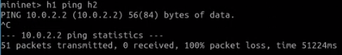

В скомпилированный файл добавили парсеры для ipv4 и ethernet загловков:

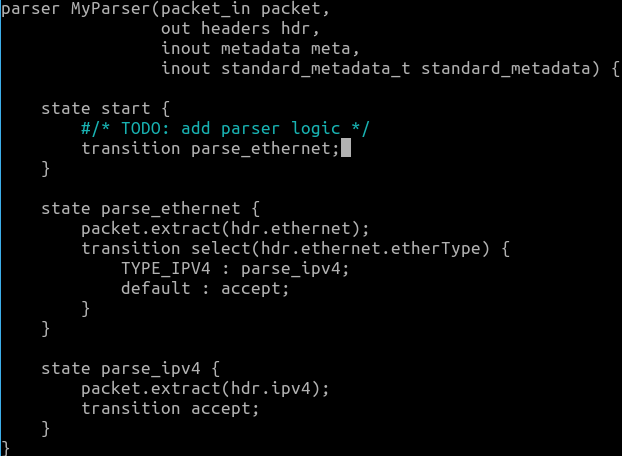

Прописано действие отправки пакета IPv4 с указанием порта, на который должны отправляться пакеты. Затем обновляется адрес назначения Ethernet и обновляется исходный адрес Ethernet, и время жизни пакета уменьшается на 1:

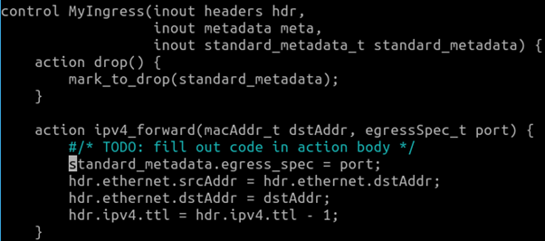

Определена таблица маршрутицазии:

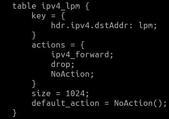

Написали условие применения ipv4_lpm, если заголовок ipv4 валидный:

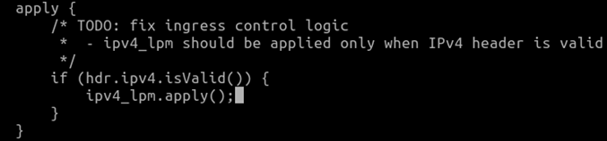

С помощью команды pingall снова проверили подключение, пинг проходит:

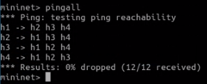

### Задание 2

Теперь меняем файл basic_tunnel.p4 для настройки туннелирования.

Обновили парсер myParser, определив новый заголовок myTunnel:

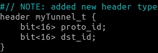

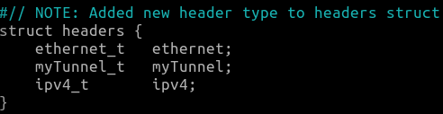

Добавлен парсер parse_myTunnel, который извлекает заголовок myTunnel:

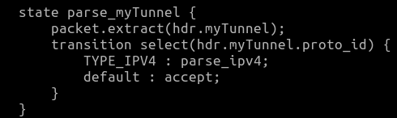

Внесены изменения в парсер parse_ethernet, чтобы осуществлять извлечение ipv4 заголовка или myTunnel заголовка, в зависимости от значения поля etherType:

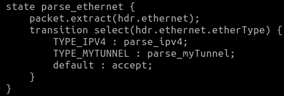

Далее определили таблицу myTunnel_exact, которая управляет маршрутизацией пакетов myTunnel. Эта таблица вызывает функцию myTunnel_forward, которая определяет порт для отправки исходящих пакетов:

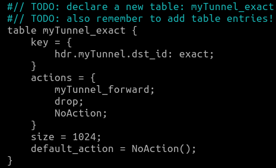

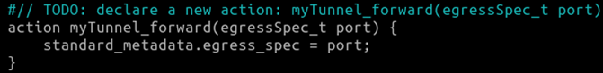

Изменили функцию apply, которая выбирает соответствующую таблицу в зависимости от типа пакетов:

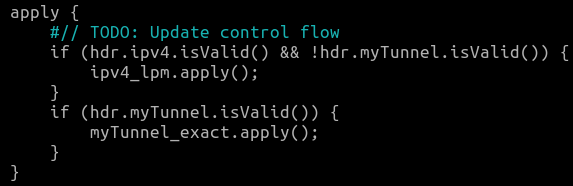

Написали депарсер:

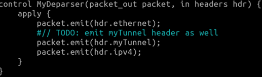

Дальше отправили пакет с h1 на h2 без использования туннелирования, и переданное сообщение было успешно доставлено до адресата:

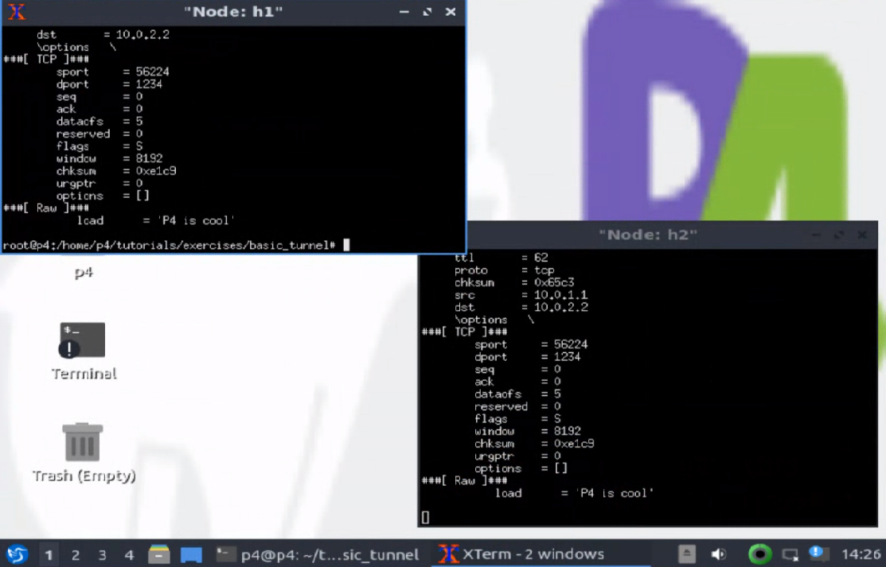

После этого отправили пакет на адрес h3, используя данные для заголовка туннелирования dst_id для h2. Вместо того, чтобы достичь h3, пакет был перенаправлен на h2 из-за применения таблицы маршрутизации myTunnel_exact:

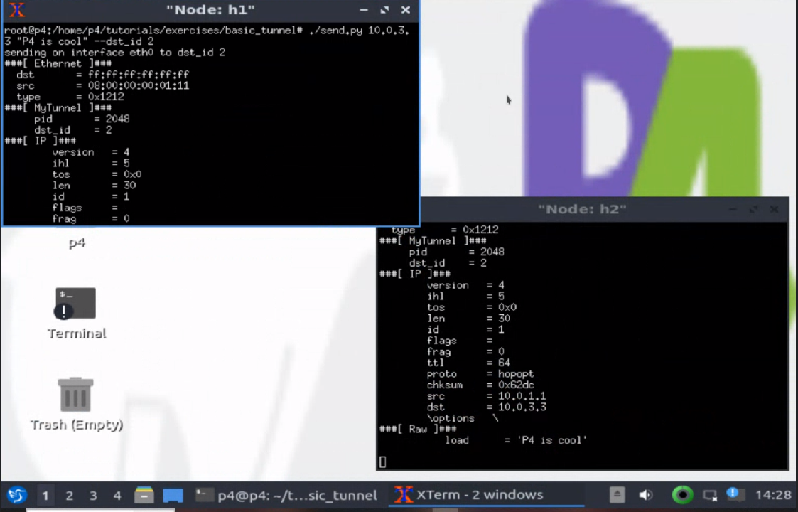

### Схемы

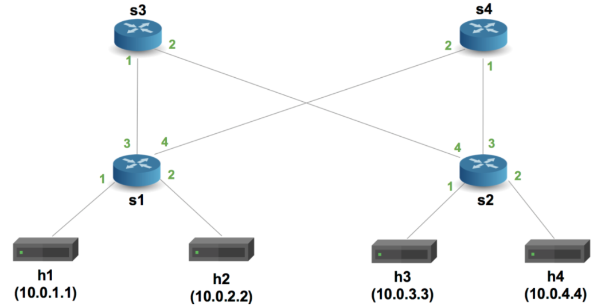

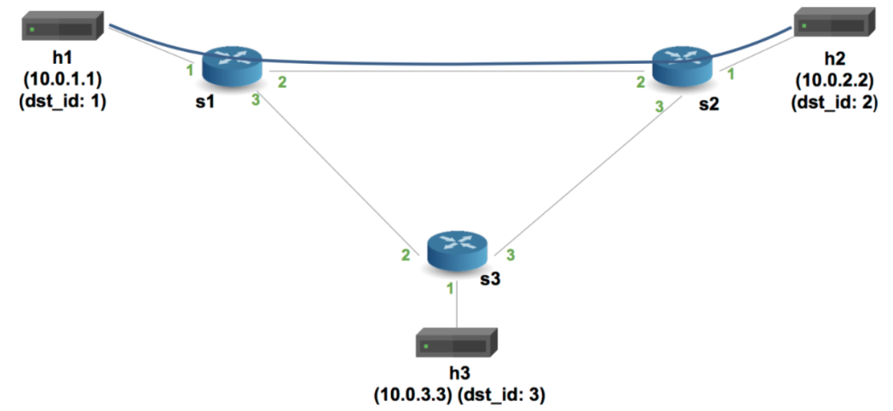

## Вывод
В процессе выполнения лабораторной работы были исследованы возможности стандартного перенаправления пакетов и туннелирования. Также были реализованы эти механизмы с использованием языка P4.
